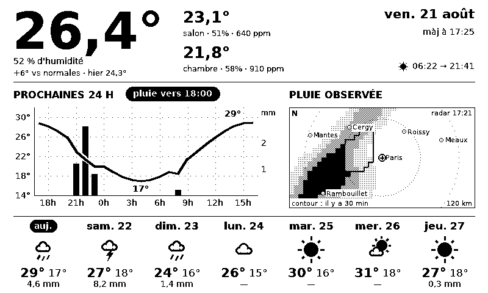

# Projet Zephyr : station météo e-ink

Dashboard météo sur écran e-paper 7,5″, piloté par un Raspberry Pi 4 et rafraîchi
toutes les 10 minutes.



*Rendu réel du programme, en données de démonstration (`--dev --fake`). 800×480 en
noir et blanc pur : c'est exactement ce que l'écran affiche.*

Il combine trois sources :

- les mesures de la station **Netatmo** (extérieur et pièces intérieures) ;
- les prévisions **AROME HD** de Météo-France pour les 24 heures qui viennent ;
- les prévisions **ECMWF** pour les 7 jours, via [Open-Meteo](https://open-meteo.com)
  dans les deux cas.

Quand une averse approche, une carte régionale des précipitations remplace la moitié
droite du graphique, puis disparaît une fois l'épisode passé.

## Matériel

- Raspberry Pi 4, Raspberry Pi OS Lite 64 bits
- Waveshare 7.5″ e-Paper HAT V2 (800×480, monochrome, SPI, driver `epd7in5_V2`)
- une station Netatmo avec au moins le module extérieur

## Mode dev (sur un poste de travail, sans matériel)

```bash
python -m venv .venv
.venv/Scripts/pip install -e .          # Linux/macOS : .venv/bin/pip
.venv/Scripts/python -m zephyr.main --dev --fake   # PNG ./out/dashboard.png, aucun réseau
.venv/Scripts/python -m zephyr.main --dev          # idem avec les vraies API (.env requis)
.venv/Scripts/python -m zephyr.preview             # rend les 4 variantes de layout
```

Le layout actif est la variante D « Épuré » (`--layout a|b|c|d` pour comparer).

`--watch 15` régénère l'image toutes les 15 minutes et écrit `out/preview.html`, une
page qui se recharge toute seule : pratique pour itérer sur la mise en page.

## Installation sur le Raspberry Pi

### 1. Flasher la carte SD

Avec **Raspberry Pi Imager** (`winget install --id RaspberryPi.Imager -e`) : appareil
**Raspberry Pi 4**, OS **Raspberry Pi OS Lite (64-bit)**, puis **Edit settings** avant
d'écrire :

- hostname `zephyr`, le Pi sera joignable en `zephyr.local`
- utilisateur `benfd` (doit correspondre à `User=` dans `deploy/zephyr.service`)
- Wi-Fi (SSID, mot de passe, pays `FR`), fuseau `Europe/Paris`, clavier `fr`
- onglet **Services** : cocher **Enable SSH**

Premier démarrage : 1 à 2 minutes, puis `ssh benfd@zephyr.local`.

### 2. Activer le SPI

```bash
sudo raspi-config nonint do_spi 0 && sudo timedatectl set-timezone Europe/Paris
```

### 3. Copier le projet

Depuis le poste Windows. Ne pas copier `.venv/` (binaires Windows) ; copier
impérativement `data/netatmo_token.json` s'il existe : c'est lui qui contient le
refresh token à jour, celui du `.env` ayant déjà été consommé.

```bash
ssh benfd@zephyr.local "mkdir -p ~/zephyr/data"
```

```bash
scp -r "D:\Projet Zephyr\src" "D:\Projet Zephyr\deploy" benfd@zephyr.local:zephyr/
```

```bash
scp "D:\Projet Zephyr\pyproject.toml" "D:\Projet Zephyr\.env" benfd@zephyr.local:zephyr/
```

```bash
scp "D:\Projet Zephyr\data\netatmo_token.json" benfd@zephyr.local:zephyr/data/
```

### 4. Installer les dépendances

```bash
sudo apt update && sudo apt install -y git python3-venv python3-pip python3-dev swig liblgpio-dev libopenjp2-7 fonts-dejavu-core
cd /home/benfd/zephyr
python3 -m venv .venv
.venv/bin/pip install -e .
# bibliothèque officielle Waveshare (fournit le paquet waveshare_epd)
.venv/bin/pip install "git+https://github.com/waveshareteam/e-Paper.git#subdirectory=RaspberryPi_JetsonNano/python"
# dépendances matérielles que le setup Waveshare ne déclare pas
.venv/bin/pip install spidev gpiozero lgpio
```

### 5. Configurer Netatmo

*(à sauter si `.env` et `data/netatmo_token.json` viennent du poste dev)*

Sur <https://dev.netatmo.com> : **My apps → Create** pour obtenir le client ID et le
client secret, puis **Token generator** avec le scope `read_station` pour le refresh
token. Reporter le tout dans `.env` (`cp .env.example .env`).

L'API météo n'expose pas les noms de pièces de l'app, mais le `module_name` de chaque
module, et pour la station de base un `station_name` auto-généré du genre « Maison
(Indoor) ». D'où l'alias d'affichage :

```
NETATMO_INDOOR_MODULES=Maison (Indoor)=Salon,Chambre
```

(sélectionne et ordonne par nom API, insensible à la casse ; la partie après `=` est le
nom affiché ; vide = toutes les pièces trouvées, base en premier)

### 6. Brancher l'écran

**Pi éteint** (`sudo poweroff`, attendre l'extinction de la LED verte, débrancher) :

1. **Nappe → HAT** : soulever le loquet du connecteur FPC, insérer la nappe à fond
   (contacts côté carte, suivre la sérigraphie), rabattre le loquet. La nappe est
   fragile : ne pas la plier à angle vif.
2. **Interrupteurs du HAT** : `Display Config` sur **B**, `Interface Config` sur **0**
   (positions d'usine normalement, mais mieux vaut vérifier).
3. **HAT → Pi** : enficher sur les 40 broches GPIO, bien aligné et à fond.

Le full refresh fait clignoter l'écran pendant ~4 s à chaque cycle : c'est le cycle
anti-ghosting, pas un défaut. Éviter le plein soleil direct pour la dalle.

### 7. Premier test

```bash
cd /home/benfd/zephyr
.venv/bin/python -m zephyr.main --dev   # vérifie la collecte, écrit out/dashboard.png
.venv/bin/python -m zephyr.main         # affiche sur l'écran e-ink
```

### 8. Mise en service

```bash
sudo cp deploy/zephyr.service deploy/zephyr.timer /etc/systemd/system/
sudo systemctl daemon-reload
sudo systemctl enable --now zephyr.timer
```

```bash
systemctl list-timers zephyr.timer      # prochaine échéance
journalctl -u zephyr.service -f         # logs de collecte et de rendu
```

Pour consulter l'écran depuis le réseau local, un second service sert `out/`, que le
programme réécrit à chaque cycle :

```bash
sudo cp ~/zephyr/deploy/zephyr-preview.service /etc/systemd/system/
sudo systemctl daemon-reload && sudo systemctl enable --now zephyr-preview.service
```

Le miroir est alors sur `http://zephyr.local:8000/preview.html`.

## Dépannage

- **Cartouche « ! DONNÉES DE HH:MM »** : une source est servie depuis le cache, ou la
  mesure Netatmo a plus d'une heure. La cause est dans `journalctl -u zephyr.service`.
- **`invalid_grant` Netatmo** : le refresh token a été invalidé. Supprimer
  `data/netatmo_token.json`, en regénérer un et le remettre dans `.env`.
- **Erreur GPIO/SPI** : vérifier `ls /dev/spidev*` et l'enfichage du HAT. Sur Bookworm :
  `.venv/bin/pip install gpiozero lgpio`.
- **`RuntimeError: Aucune police trouvée`** : installer `fonts-dejavu-core`, absent de
  Raspberry Pi OS Lite.

## Notes

- **Une seule instance à la fois.** Netatmo fait tourner ses refresh tokens : deux
  machines qui partagent le même token se le volent à tour de rôle. Pour garder un
  aperçu sur le poste dev, lui générer son propre token.
- **AROME HD ne fournit pas `cloud_cover`** (l'API renvoie `null` partout), d'où
  l'absence de bandeau de couverture nuageuse. L'ensoleillement se lit sur les
  pictogrammes de la rangée 7 jours.
- **Les min/max du jour viennent d'AROME**, pas d'ECMWF : à 24 h d'échéance l'écart
  atteint 3 °C, et c'est la source de la courbe juste au-dessus. Les six autres jours
  restent à ECMWF, seul modèle à porter aussi loin.
- **La carte régionale n'est demandée que si de la pluie est attendue sous 3 heures.**
  Elle coûte 312 points en une requête ; à chaque cycle de la journée, on sortirait des
  quotas gratuits. Les repères urbains sont dans `CITIES` (`render/common.py`),
  à adapter à sa région.
- **Les normales de saison** (1991-2020) sont calculées une fois depuis l'archive ERA5,
  puis mises en cache dans `data/normals.json`.
- **Rendu** : niveaux de gris avec Pillow puis binarisation par seuil, jamais de
  tramage. Full refresh uniquement, écran en veille entre deux cycles.
